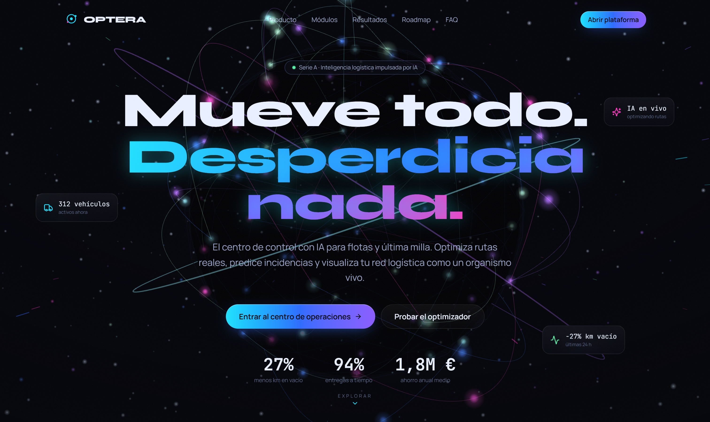
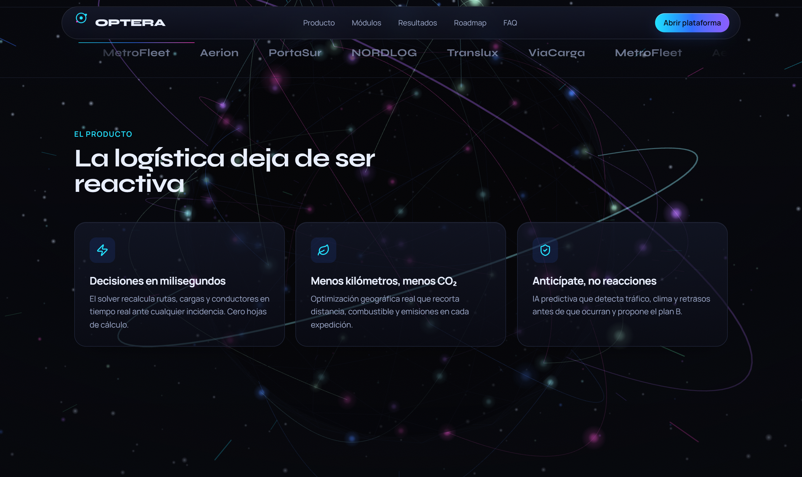
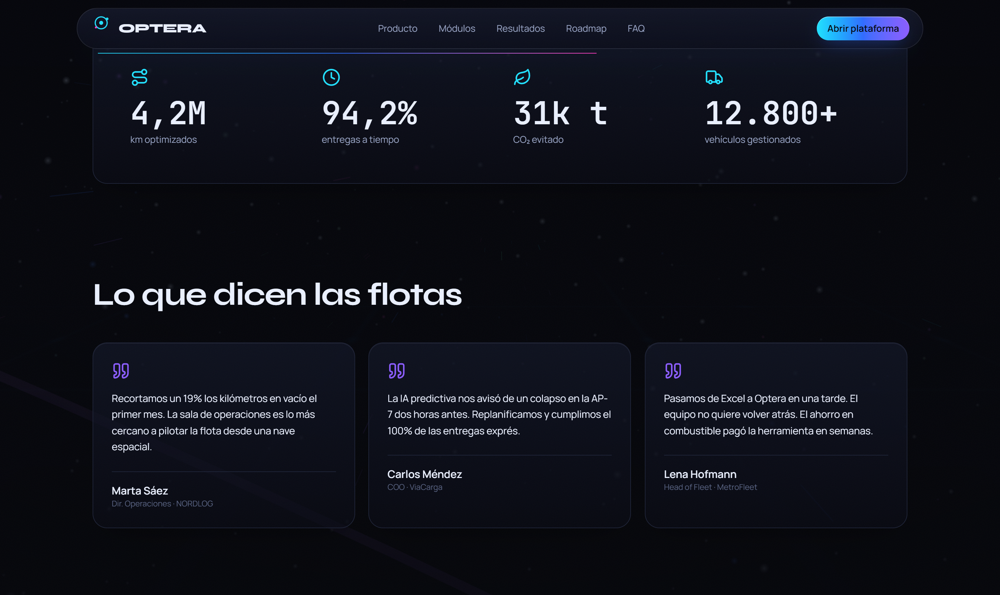
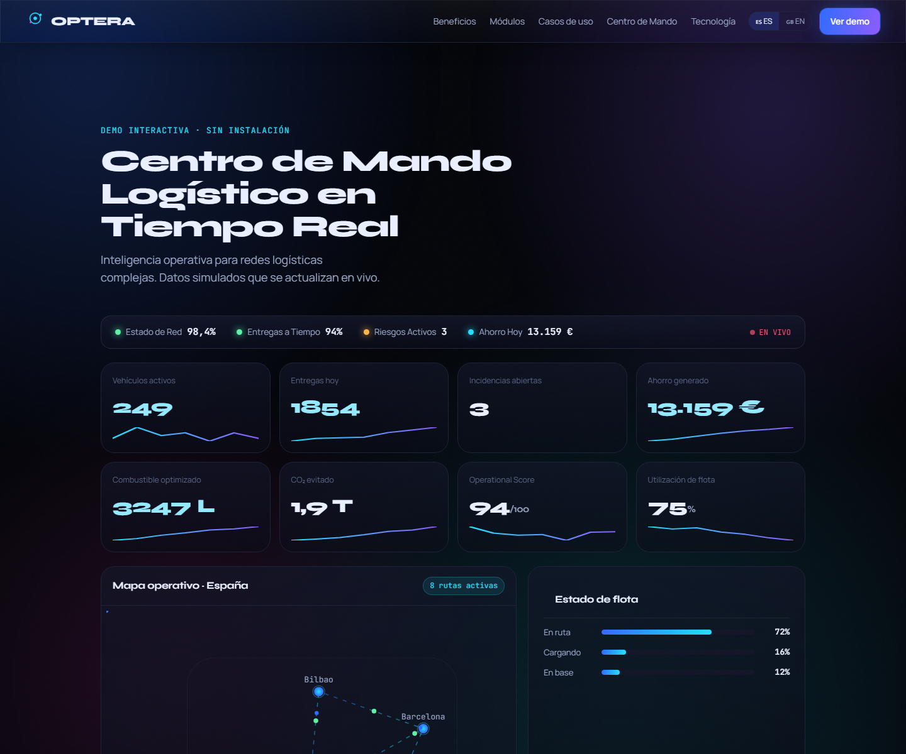
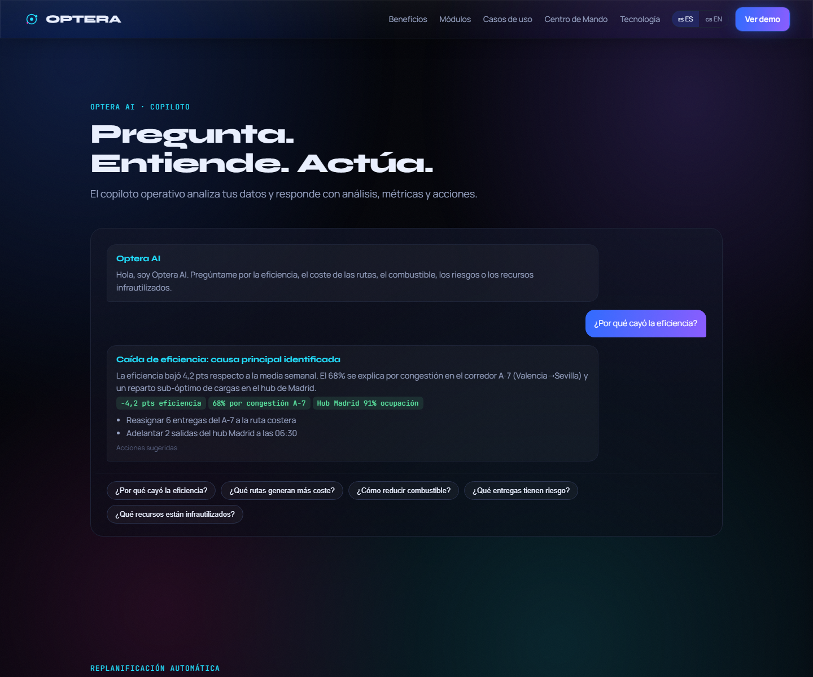
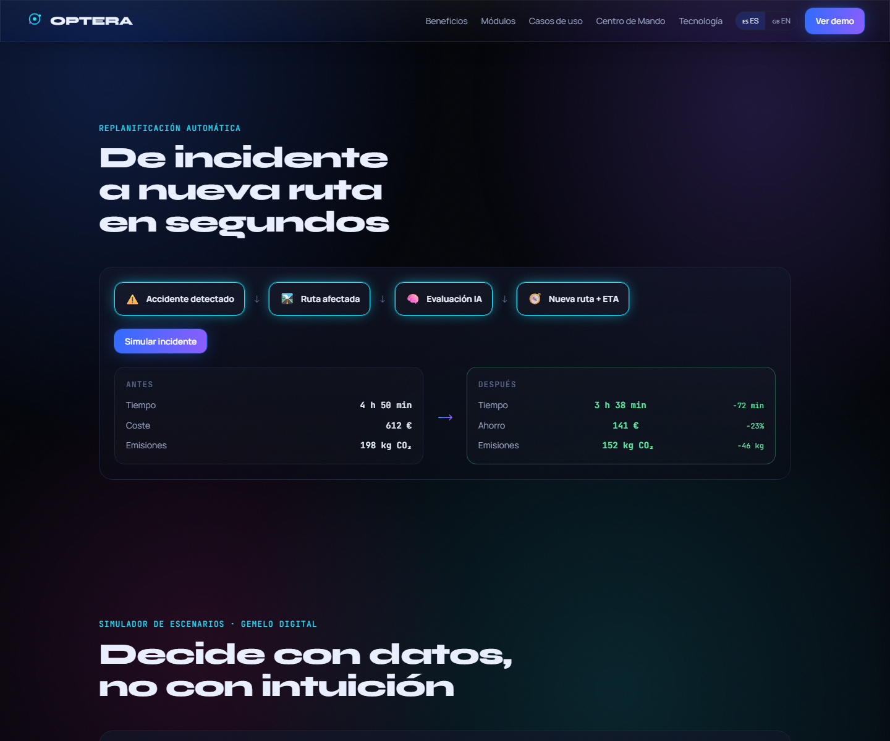
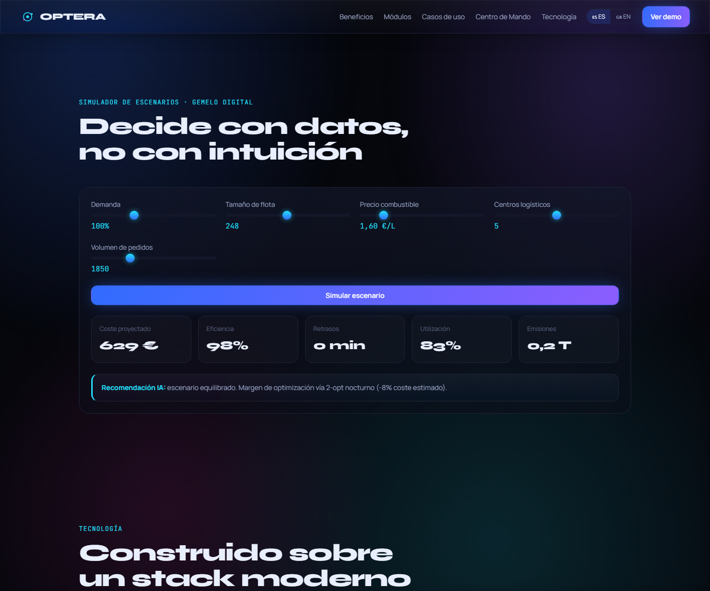

# Optera

### Plataforma de inteligencia logística autónoma impulsada por IA

**Mueve todo. Desperdicia nada.**

Optera es una plataforma de inteligencia logística empresarial que monitoriza, optimiza, predice, replanifica, decide y simula operaciones logísticas complejas en tiempo real mediante IA avanzada, agentes autónomos y digital twins.

[**▶ Probar la demo interactiva**](https://svetoslav1999.github.io/optera/) · sin instalar nada · en castellano

---

> Repositorio **público** de presentación: muestra el producto y una **demo
> interactiva completa** sin exponer el código fuente ni la propiedad intelectual.
> La demo funciona 100% en el navegador, sin backend.

---

## ✦ Demo interactiva

Una demo profesional, en castellano, que puedes usar sin instalar nada:

🔗 **https://svetoslav1999.github.io/optera/**

Incluye:

- **Centro de Mando Logístico** con barra de estado global y KPIs en tiempo real.
- **Mapa operativo de España** (Madrid · Barcelona · Valencia · Bilbao · Sevilla) con rutas y vehículos animados.
- **Optera AI** — copiloto que analiza, explica y recomienda acciones.
- **Agente Autónomo** — detecta incidencias, evalúa impacto, decide y actúa solo.
- **Decision Center** — historial de decisiones IA con impacto económico, confianza y estado.
- **Digital Twin** — gemelo digital con escenarios: Black Friday, Navidad, Huelga, Cierre de Hub, Combustible +25%.
- **Replanificación automática** — de incidente a nueva ruta y ETA en segundos.
- **Simulador what-if** — sliders interactivos (demanda, flota, combustible, hubs, pedidos).
- **Network Score** — índice global de salud operativa 0–100.
- Selector de idioma 🇪🇸 Español (por defecto) · 🇬🇧 English.

---

## ✦ Capturas

> Capturas **reales** de la plataforma en ejecución. La landing estrena la
> *Immersive Edition*: una escena **WebGL full-bleed** (red logística viva,
> shaders GLSL, *hyperspace streaks* y horizonte holográfico) con **scroll
> cinematográfico** — la cámara atraviesa la red a medida que desplazas.

| Hero — red logística viva | Viaje — hyperspace + producto |
|---|---|
|  |  |

| Centro de Mando (demo) | Optera AI (demo) |
|---|---|
|  |  |

| Replanificación (demo) | Simulador (demo) |
|---|---|
|  |  |

---

## ✦ Beneficios

- **Visibilidad total en tiempo real.** Cada vehículo, entrega e incidencia en un único pulso operativo vivo.
- **Agente autónomo.** Detecta, analiza, decide y ejecuta acciones sin intervención humana.
- **Decisiones asistidas por IA.** Optera AI explica qué pasa, por qué y qué hacer — con métricas y acciones.
- **Replanificación autónoma.** Ante un incidente, evalúa, reroutea y recalcula la ETA en segundos.
- **Digital Twin.** Simula escenarios extremos antes de que ocurran: picos de demanda, cierres, crisis.
- **Coste por entrega más bajo.** Solver real que recorta kilómetros vacíos y combustible.
- **Anticipación al riesgo.** IA predictiva sobre tráfico, clima e incidencias.
- **Sostenibilidad medible.** CO₂ evitado y combustible optimizado, cuantificados por día y ruta.

## ✦ Resultados de referencia

- **27%** menos kilómetros en vacío
- **94%** de entregas a tiempo
- **1,8 M €** de ahorro anual estimado
- **Decisiones autónomas** ejecutadas en segundos, auditables y reversibles

---

## ✦ Módulos

| # | Módulo | Descripción |
|---|--------|-------------|
| 01 | 🛰️ **Centro de Operaciones** | Pulso en vivo de flota, entregas e incidencias. |
| 02 | 🧭 **Motor de Optimización** | Solver real (haversine + nearest-neighbour + 2-opt) con coste, tiempo y ahorro. |
| 03 | 🗺️ **Mapa Interactivo** | Red logística animada con hubs y vehículos en movimiento. |
| 04 | 🧠 **IA Predictiva** | Tráfico, clima e incidencias + alertas y recomendaciones. |
| 05 | 📊 **Centro de Inteligencia** | Analítica avanzada y scores globales. |
| 06 | 🤖 **Optera AI** | Copiloto que analiza, explica y recomienda. |
| 07 | ⚡ **Replanificación Automática** | Reroute autónomo ante incidentes. |
| 08 | 🔮 **Simulador de Escenarios** | Sliders what-if sobre demanda, flota, combustible, hubs y pedidos. |
| 09 | 🤖 **Agente Autónomo Logístico** | Detecta eventos, genera decisiones y las ejecuta de forma autónoma. |
| 10 | 🎯 **Decision Center** | Historial de decisiones IA: impacto económico, confianza y trazabilidad. |
| 11 | 🧬 **Digital Twin** | Réplica virtual de la red para simular escenarios extremos. |
| 12 | 💰 **Cost Intelligence** | Análisis de coste por ruta, hub y vehículo con recomendaciones de reducción. |

---

## ✦ Nuevas capacidades

### 🤖 Agente Autónomo Logístico

La red observa continuamente el estado operativo. Cuando detecta una anomalía:

1. **Detecta** el evento (incidencia, saturación, desvío de ETA).
2. **Analiza** el impacto en rutas, entregas y coste.
3. **Genera** un conjunto de decisiones ordenadas por prioridad.
4. **Ejecuta** la acción óptima de forma autónoma (modo auto) o solicita confirmación (modo semi).
5. **Registra** la decisión con auditoría completa: timestamp, confianza IA, impacto, estado y trazabilidad de reversión.

### 🎯 Decision Center

Panel de control de todas las decisiones tomadas por la IA:

- Decisión ejecutada con descripción completa.
- Impacto económico estimado (€ ahorrados o coste evitado).
- Confianza de la IA (%).
- Estado: pendiente / ejecutada / revertida.
- Historial completo con capacidad de reversión.

### 🧬 Digital Twin

Réplica virtual de la red logística que simula escenarios extremos antes de que sucedan:

| Escenario | Descripción |
|-----------|-------------|
| 🛍️ Black Friday | +180% demanda, flota al límite |
| 🎄 Navidad | +140% pedidos, ventanas ajustadas |
| ✊ Huelga de transporte | -40% capacidad disponible |
| 🏭 Cierre de hub | Redistribución forzada a hubs alternativos |
| ⛽ Combustible +25% | Impacto en coste y emisiones |

Cada escenario recalcula en tiempo real: coste proyectado, eficiencia, retrasos, utilización, emisiones y recomendaciones IA.

### 🌐 Optera Network Score

Índice global de salud operativa 0–100, calculado sobre:

- **SLA** — cumplimiento de ventanas de entrega
- **Eficiencia** — utilización de recursos vs. coste
- **Coste** — coste por entrega vs. benchmark
- **Emisiones** — CO₂ por km vs. objetivo
- **Utilización** — ocupación de flota y hubs
- **Incidencias** — frecuencia y severidad de eventos

---

## ✦ Tecnología

`Next.js 16` · `React 19` · `TypeScript` · `TailwindCSS v4` · `Three.js / React Three Fiber` ·
`Framer Motion` · `GSAP` · `Node.js / Express` · `Prisma / SQLite` · motor de IA determinista · agente autónomo · digital twin engine.

La demo pública de este repositorio es **HTML + CSS + JavaScript puro** (sin
dependencias ni build), desplegada con GitHub Pages desde `/docs`.

---

## ✦ Roadmap público

- [x] Optimizador de rutas multi-flota
- [x] Gemelo digital 3D de la red logística
- [x] IA predictiva de incidencias
- [x] Optera AI (copiloto de decisión)
- [x] Replanificación automática ante incidentes
- [x] Simulador de escenarios what-if
- [x] Agente autónomo logístico (decisión + ejecución)
- [x] Decision Center con auditoría completa
- [x] Digital Twin con escenarios extremos
- [x] Cost Intelligence y Carbon Intelligence
- [x] Executive AI (briefings ejecutivos sobre datos reales)
- [ ] Marketplace de capacidad entre operadores
- [ ] App móvil para conductores
- [ ] Integración con ERPs y TMS externos

---

## ✦ Contacto

¿Interesado en Optera para tu operación logística?

- 🌐 Demo: https://svetoslav1999.github.io/optera/
- ✉️ Email: hola@optera.app

---

© 2026 Optera · Todos los derechos reservados.

