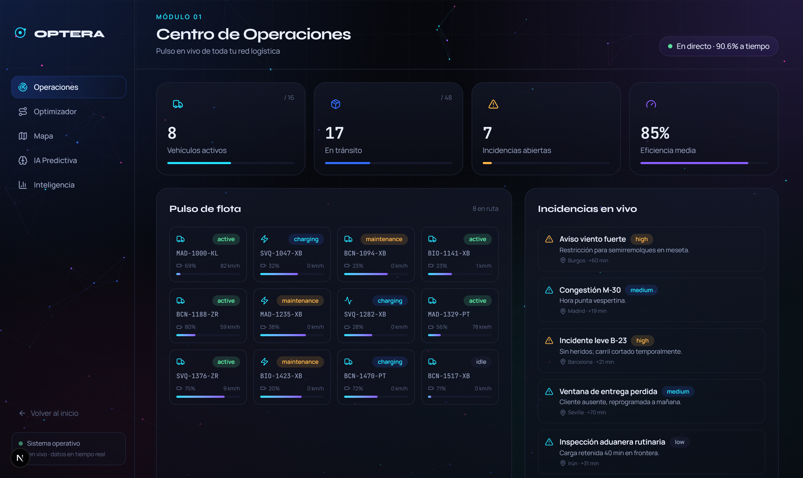
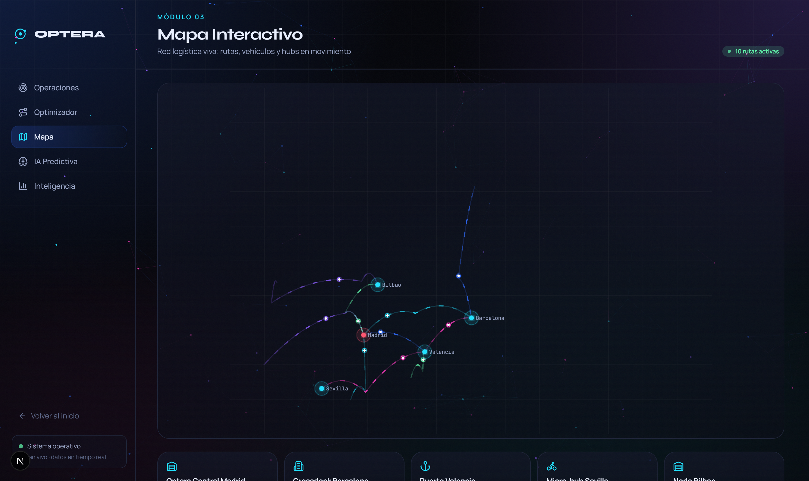
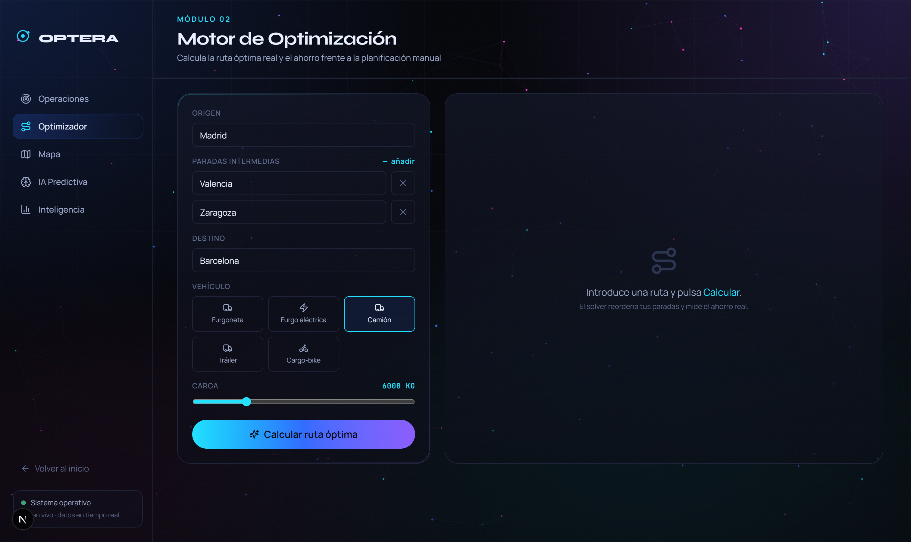
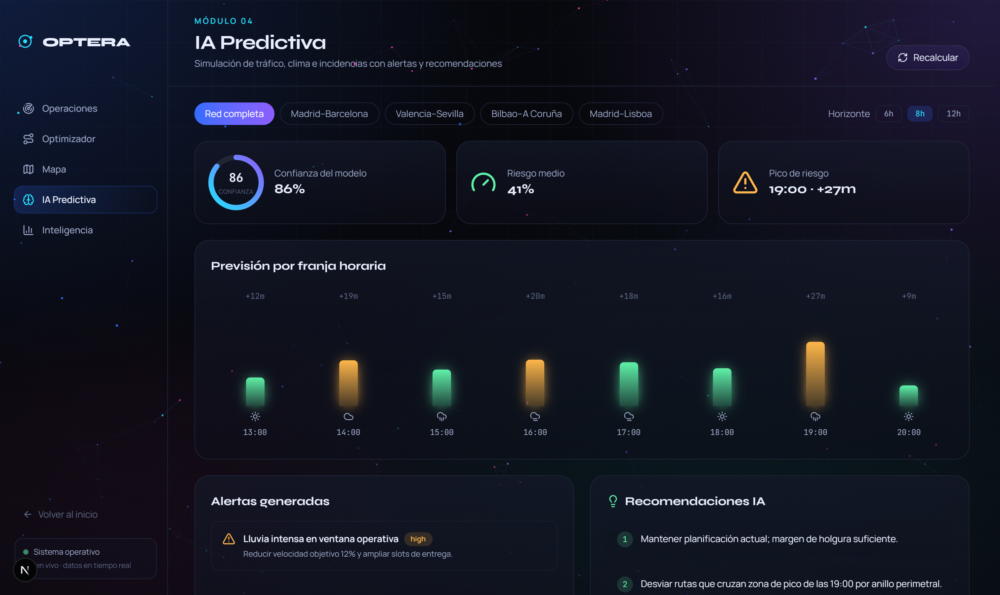
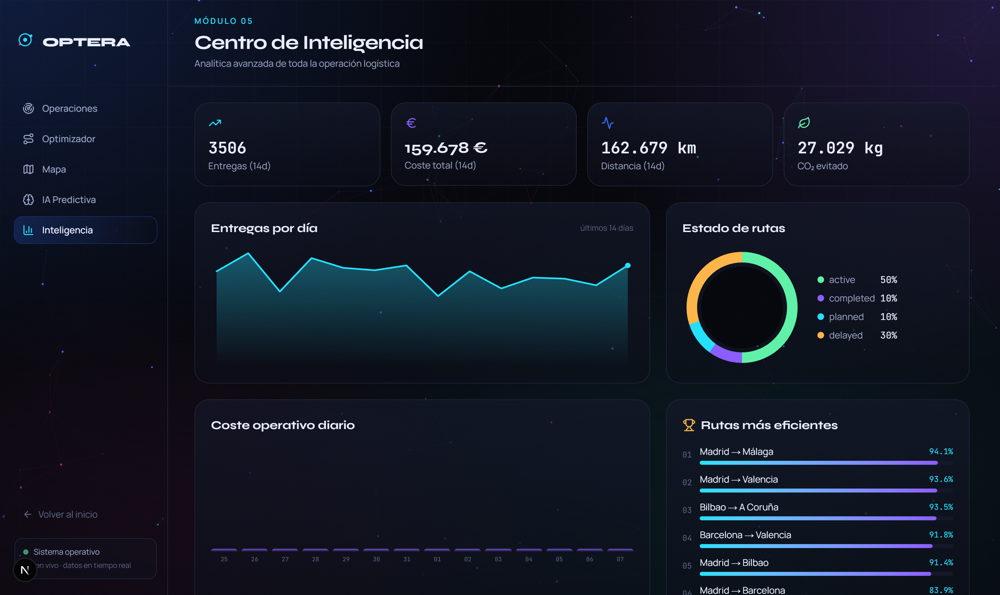

# ✦ Optera

### Inteligencia logística impulsada por IA

**Mueve todo. Desperdicia nada.**

---

Optera es una plataforma web moderna diseñada para **optimizar procesos y mejorar
la experiencia de usuario** mediante automatización, análisis y herramientas
inteligentes. Orientada a empresas de transporte, operadores logísticos,
distribución, última milla y gestión de flotas.

> Este repositorio público muestra información general del proyecto **sin exponer
> propiedad intelectual ni código fuente**.

---

## ✦ Capturas

| Centro de Operaciones | Mapa Interactivo |
|---|---|
|  |  |

| Motor de Optimización | IA Predictiva |
|---|---|
|  |  |

---

## ✦ Beneficios

- **Menos kilómetros, menos coste.** Optimización de rutas que recorta distancia,
  combustible y emisiones en cada expedición.
- **Decisiones en tiempo real.** Recálculo automático de rutas y recursos ante
  cualquier incidencia.
- **Anticipación, no reacción.** IA predictiva que detecta tráfico, clima y
  retrasos antes de que ocurran.
- **Visión total.** Un centro de control vivo de toda la red logística.

## ✦ Funcionalidades principales

| Módulo | Descripción |
|--------|-------------|
| 🛰️ **Centro de Operaciones** | Pulso en vivo de flota, entregas e incidencias. |
| 🧭 **Motor de Optimización** | Ruta óptima con coste, tiempo, emisiones y ahorro. |
| 🗺️ **Mapa Interactivo** | Red logística animada con vehículos y hubs en movimiento. |
| 🧠 **IA Predictiva** | Simulación de tráfico/clima + alertas y recomendaciones. |
| 📊 **Centro de Inteligencia** | Analítica avanzada con visualizaciones a medida. |

## ✦ Resultados de referencia

- **27%** menos kilómetros en vacío
- **94%** de entregas a tiempo
- **1,8 M €** de ahorro anual medio

## ✦ Roadmap público

- [x] Optimizador de rutas multi-flota
- [x] Gemelo digital 3D de la red logística
- [x] IA predictiva de incidencias
- [ ] Reasignación autónoma de rutas y conductores
- [ ] Marketplace de capacidad entre operadores
- [ ] App móvil para conductores

## ✦ Contacto

¿Interesado en Optera para tu operación logística?

- 🌐 Web: próximamente
- ✉️ Email: hola@optera.app

---

© 2026 Optera · Todos los derechos reservados.

